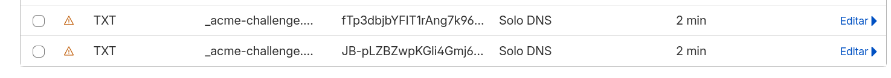
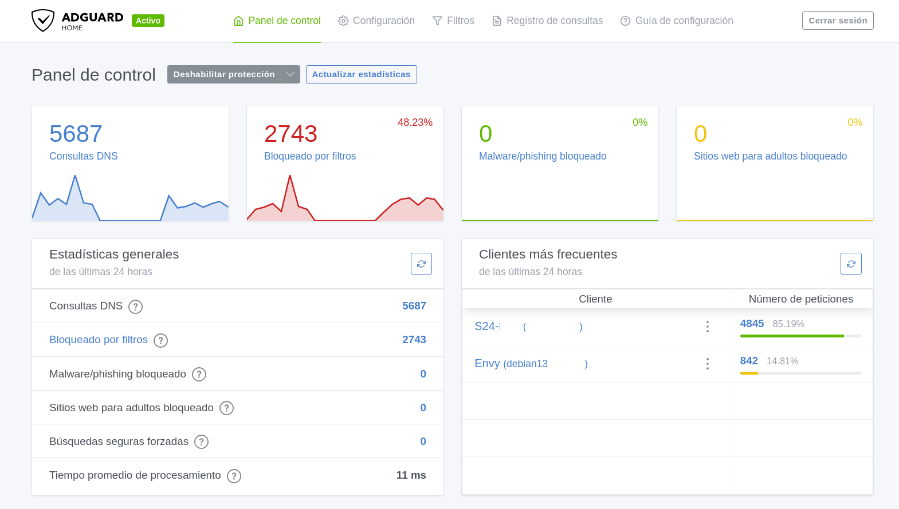
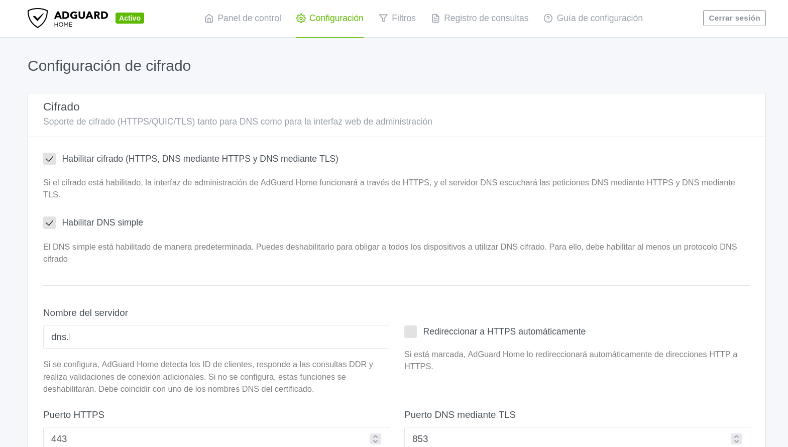
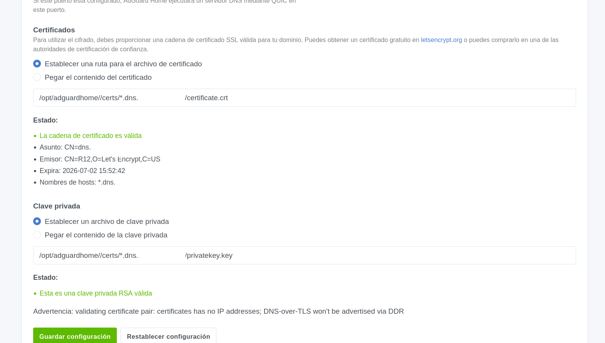
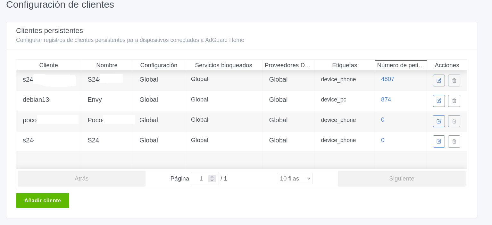
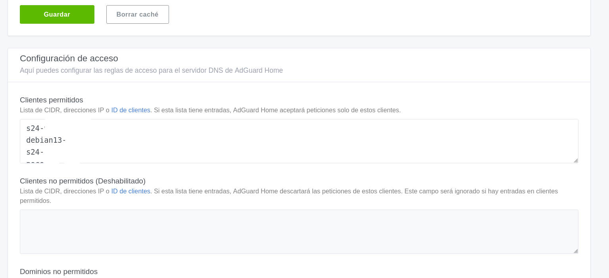
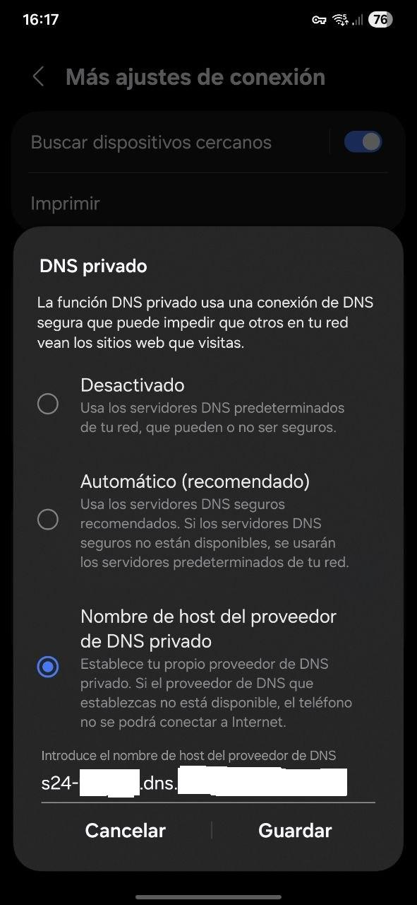

## Adguard Home
  
Según su web, [Adguard Home](https://adguard.com/es/welcome.html) es el primer bloqueador de anuncios para Linux a nivel de sistema en el mundo. Bloquea anuncios y rastreadores en el dispositivo, selecciona de los filtros preinstalados o añade los tuyos propios, todo a través de la interfaz de línea de comandos.  

Características:  
1.- Bloqueo de anuncios: El bloqueador de anuncios AdGuard elimina los molestos banners, ventanas emergentes y anuncios de vídeo.  
2.- Protección de privacidad: El bloqueador de anuncios AdGuard protege tus datos de web analytics y los rastreadores online.  
3.- Seguridad de navegación: El bloqueador de anuncios AdGuard protege contra el phishing y los sitios maliciosos.  
4.- Control parental: El bloqueador de anuncios AdGuard protege a los niños del contenido adulto e inapropiado.  

### Instalación en el VPS

Usaremos docker como es habitual.
```bash
services:
  adguardhome:
    image: adguard/adguardhome:latest
    container_name: adguardhome
    restart: unless-stopped
    ports:
      # DNS (imprescindible)
      - "53:53/tcp"
      - "53:53/udp"
      # Web UI - Solo para el primer arranque del contenedor - Luego lo comentamos
#      - "3000:3000/tcp"
      # DoT (DNS over TLS) nosotros vamos a usarlo
      - "853:853/tcp"
    volumes:
      - ./conf:/opt/adguardhome/conf
      - ./data:/opt/adguardhome/work
      - ./certs:/opt/adguardhome/certs:ro

    networks:
      - infra_network # <--- Nuestra red de traefik

  certs-extractor:
    image: ldez/traefik-certs-dumper:v2.8.1
    container_name: certs-extractor
    entrypoint: sh -c "
      traefik-certs-dumper file --watch --version v2 --source /data/acme.json --dest /output --domain-subdir &&
      chmod -R 600 /output/*"
    volumes:
      - /home/noe/traefik-crowdsec/traefik/ssl/acme.json:/data/acme.json:ro  # Ruta a TU archivo acme.json
      - ./certs:/output                         # Donde se guardarán los .pem
    networks:
      - infra_network # <--- Nuestra red de traefik

networks:
  infra_network:
    external: true 
```
Nuestro stack consta de dos contenedores.
1.- Adguardhome. Configuración sencilla. Solo es destacable que para el primer arranque mapeamos el puerto 3000 y una vez hecha la configuración inicial podemos comentarlo, ya que accederemos al panel a través de adguard.midominio.com. Aunque miestras escribo igual vuelvo a mapearlo para que solo sea accesible desde tailscale.  
2.- Certs-extractor. Este contenedor se encarga de extraer los certificados de traefik para usar el DNS over TLS. Esta parte es muy importante porque traefik guarda los certificados juntos en el mismo fichero **acme.json**. Este docker se encarga de extraer los certificados que contiene acme.json en dos ficheros: **certificate.crt y privatekey.key**

**En la configuración inicial se dejan todos los valores por defecto**. Lo único que tenemos que modificar es el usuario y la contraseña. 

### Configuraciones en traefik

Nos vamos a traefik para adaptarlo a nuestro Adguard Home.  

Editamos nuestro fichero traefik.yml y añadimos un nuevo entrypoint para los DNS over TLS:
```bash
entryPoints:
  web:
    address: ":80"
    http:
      redirections:
        entryPoint:
          to: websecure
          scheme: https
  websecure:
    address: ":443"
    http:
      tls:
        certResolver: letsencrypt
#        certResolver: letsencrypt_staging

        # Primer dominio
        domains:
          - main: "midominio.com"
            sans:
              - "*.midominio.com"
        # Segundo dominio
          - main: "lasnotasdenoah.com"
            sans:
              - "*.lasnotasdenoah.com"
  # Entrypoint para dns adguard-home
  dot:
    address: ":853"
```

En nuestro directorio conf.d creamos el fichero dns.yml:
```bash
# Esta primera parte de http simplemente es el acceso al panel de adguard como cualquier otro servicio.
http:
  routers:
    adguard-ui:
      rule: "Host(`adguard.midominio.com`)"
      service: adguard-ui
      entryPoints:
        - websecure
      tls: {}   # o simplemente ‘tls: true’ en v3
      # Protegemos nuestro panel con los middleware
      middlewares:
        - geoblock-es
        - crowdsec-bouncer
        - security-headers
  services:
    adguard-ui:
      loadBalancer:
        servers:
          # Como estamos en la misma red docker, no hace falta poner dirección IP. Usamos el nombre del contenedor y traefik lo entiene perfectamente.
          - url: "http://adguardhome:80"

# Aquí configuramos la conexión DNS
tcp:
  routers:
    adguard-dot:
      rule: "HostSNI(`dns.midomnio.com`)"
      service: adguard-dot
      # Usamos el nuevo entryPoint que configuramos en traefik.yml por el puerto 853 que es el que usa DNS over TLS
      entryPoints:
        - dot
      # IMPORTANTÍSIMO: Tenemos que forzar a ACME a generar este dominio. MOTIVO: identificar de forma individual los equipos que se pueden conectar y de rebote vemos las estadísticas de uso de cada uno
      tls:
        certResolver: letsencrypt
        domains:  # ← Esto fuerza ACME para este dominio específico
          - main: "dns.midominio.com"
            sans:
              - "*.dns.midominio.com"
  services:
    adguard-dot:
      loadBalancer:
        servers:
          - address: "adguardhome:853"
```

```bash
# Reiniciamos traefik
docker compose restart traefik    

# Verificamos los logs:
docker logs traefik | grep -i acme                        
```

Y vemos la respuesta de traefik:
```bash
[...]
2026-04-03T16:32:09+02:00 ERR Unable to obtain ACME certificate for domains error="unable to generate a certificate for the domains [*.dns.midominio.com]: error: one or more domains had a problem:\n[dns.midominio.com] [dns.midominio.com] acme: error presenting token: cloudflare: failed to create TXT record: An identical record already exists. (81058)\n" ACME CA=https://acme-v02.api.letsencrypt.org/directory acmeCA=https://acme-v02.api.letsencrypt.org/directory domains=["dns.midominio.com","*.dns.midominio.com"] providerName=letsencrypt.acme routerName=adguard-certs-helper@file rule=Host(`dns.midominio.com`)
ERROR: CrowdsecBouncerTraefikPlugin: 2026/04/04 11:02:04 ServeHTTP:Get ip:88.58.78.148 cache:unreachable
[...]
```

**Pasos para solucionar el error:**   
Según Perplexity el error "An identical record already exists. (81058)" de Cloudflare DNS-01 es inofensivo (cert se genera igual), pero ensucia logs. Se soluciona borrando el TXT challenge persistente en Cloudflare.  

1.- Entramos en nuestro panel de administración de cloudflare y borramos los txt de los registros DNS


2.- Limpieza de logs de traefik:
```bash
docker exec traefik truncate -s 0 /var/log/traefik/access.log
docker exec traefik truncate -s 0 /var/log/traefik/traefik.log
```

3.- Añadimos a certificatesResolvers.letsencrypt.acme.dnsChallenge de traefik.yml:
```bash
dnsChallenge:
  provider: cloudflare
  delayBeforeCheck: 60      # Espera propagación
  resolvers:
    - "1.1.1.1:53"
    - "8.8.8.8:53"
```

4.- Verificamos con:
```bash
docker logs traefik | grep acme
# Debería dar un resultado sin errores acme
```

En [la parte 1 de configurar el VPS](https://blog.lasnotasdenoah.com/posts/vps-proxy/) tenía comentados los resolvers de traefik.yml:
```bash
        provider: cloudflare
#        resolvers:
#          - "1.1.1.1:53"
#          - "1.0.0.1:53"
```

Consulté nuevamente a Perplexity sobre ese comentario y su respuesta fue que **es MUY importante descomentarlo para DNS-01 con Cloudflare. Esos resolvers le dicen a Traefik qué DNS públicos consultar para verificar que el TXT challenge se propagó antes de pedir el certificado.**   
Beneficios inmediatos:  
1.- Renovaciones ACME 2x más rápidas  
2.- Cero errores "propagation timeout"  
3.- Logs de Traefik impecables  
4.- Rate limits Let’s Encrypt respetados  

Así que toca descomentarlo para mejorar la estabilidad con certificados wildcards:
```bash
        provider: cloudflare
        resolvers:
          - "1.1.1.1:53"
          - "1.0.0.1:53"
```

### Configuración panel Adguard Home

En la siguiente imagen vemos el panel funcionando.


Configuración de cifrado:  
1.- Marcamos el Check de Habilitar cifrado (DNS over TLS)  
2.- Nombre del servidor: dns.midominio.com



Establecemos la ruta de los certificados. En mi caso:
```bash
# Archivo del certificado
/opt/adguardhome//certs/*.dns.midominio.com/certificate.crt

# Archivo de clave privada
/opt/adguardhome//certs/*.dns.midominio.com/privatekey.key
```

Nos saldrá una confirmación en verde para decir que se han cargado correctamente:


### Configuración de clientes en Adguard Home

En esta parte vamos a configurar los clientes que pueden realizar consultas DNS por nuestro servicio.  

Esta es mi configuración


Importante:  
1.- Nombre del cliente: nombre que nos guste para ver las estadísticas.  
2.- Etiqueta: se puede seleccionar la que sea mas acorde al dispositivo.  
3.- Identificador: esta es la parte mas importante. Identificador único por ejemplo: S24-XXXXXXXXXXX  

Una vez configurados los clientes, tenemos que autorizarles el uso del DNS en Configuración DNS. **IMPORTANTE: En clientes permitidos ponemos el Identificador del cliente (NO el nombre)**


### Configuración de clientes en Linux

```bash
sudo nano /etc/systemd/resolved.conf

# Añadimos lo siguiente:

[Resolve]
DNS=IP_PUBLICA_VPS#debian13-XXXXXXXXXXXX.dns.midominio.com
FallbackDNS=9.9.9.9#dns.quad9.net
Domains=~.
DNSOverTLS=yes

# Reiniciamos systemd-resolved
sudo systemctl restart systemd-resolved.service
```

### Configuración de clientes en Android

Vamos a Ajustes -> Conexiones -> Mas ajustes de conexión -> DNS privado:
```bash
s24-XXXXXXXXX.dns.midominio.com
```


***
Fuentes:  
**Debo decir que en esta guía he tirado mucho de IA.**   
[Adguard Home](https://adguard.com/es/welcome.html)  
[Configurar VPS parte 1](https://blog.lasnotasdenoah.com/posts/vps-proxy/)  
[Configurar VPS parte 2](https://blog.lasnotasdenoah.com/posts/vps-proxy-parte2/)  