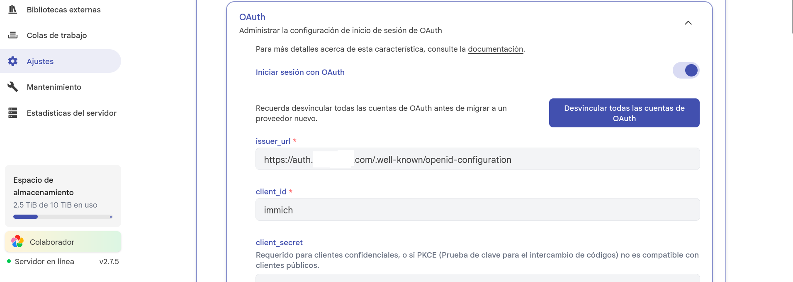
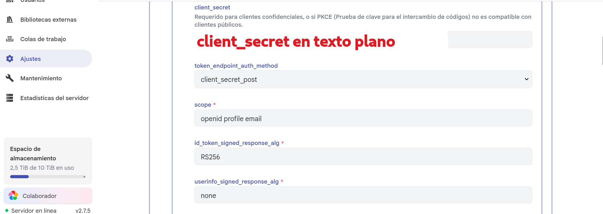
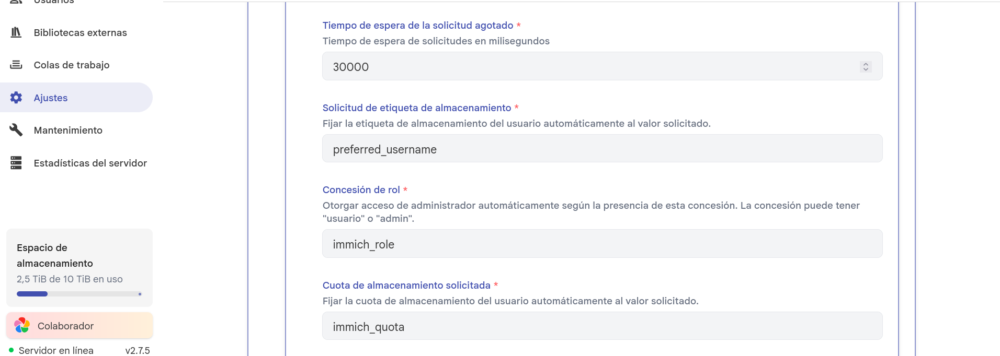
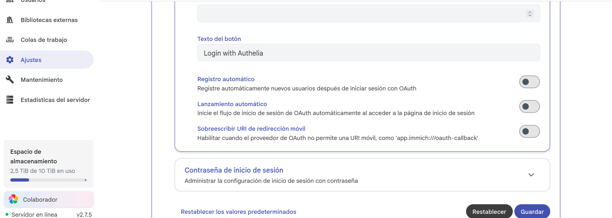
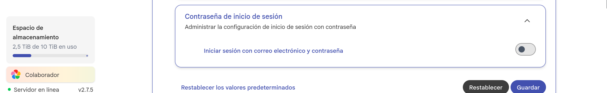

### Configuración de clientes en Authelia

Ya tenemos configurado nuestro [sistema de autenticación a través de Authelia](https://blog.lasnotasdenoah.com/posts/owncloud/) que dejamos bastante detallado en el post de Owncloud oCIS.  

### Añadir cliente nuevo en Authelia

Vamos a añadir otro cliente para [Immich](https://immich.app/).   

Siguiendo la [documentación oficial de Authelia](https://www.authelia.com/integration/openid-connect/clients/immich/) creamos un nuevo cliente modificando nuestro fichero configuration.yml:
```bash
identity_providers:
  oidc:
    ## The other portions of the mandatory OpenID Connect 1.0 configuration go here.
    ## See: https://www.authelia.com/c/oidc
    clients:
      - client_id: 'immich'
        client_name: 'immich'
        client_secret: '$pbkdf2-sha512$310000$c8p78n7pUMln0jzvd4aK4Q$JNRBzwAo0ek5qKn50cFzzvE9RXV88h1wJn5KGiHrD0YKtZaR/nCb2CJPOsKaPK0hjf.9yHxzQGZziziccp6Yng'  # The digest of 'insecure_secret'.
        public: false
        authorization_policy: 'two_factor'
        require_pkce: false
        pkce_challenge_method: ''
        redirect_uris:
          - 'https://immich.midominio.com/auth/login'
          - 'https://immich.midominio.com/user-settings'
          - 'app.immich:///oauth-callback'
        scopes:
          - 'openid'
          - 'profile'
          - 'email'
        response_types:
          - 'code'
        grant_types:
          - 'authorization_code'
        access_token_signed_response_alg: 'none'
        userinfo_signed_response_alg: 'none'
        token_endpoint_auth_method: 'client_secret_post'
```

En este punto, la única parte complicada es el client_secret. Vamos a generarlo:
```bash
# Generamos una cadena aleatoria
openssl rand -base64 48

#Resultado (lo añadimos en web de Immich)
h9JrBOoitgYvBjDEmGH7gx10e6bEnawGedXOv7+rdfbEqgqfRr56hH+eacu977Mf

# Hasheamos la cadena que hemos generado
docker exec authelia authelia crypto hash generate pbkdf2 --variant sha512 --password 'h9JrBOoitgYvBjDEmGH7gx10e6bEnawGedXOv7+rdfbEqgqfRr56hH+eacu977Mf'

#Resultado (lo añadimos en fichero configuration.yml)
Digest: $pbkdf2-sha512$310000$GHkth/w7Mv2nuZ/Wyp5.6Q$Z9r9wGFaubza/kqmyChgkzsBwyhvtT/blW633ytwJuJPdt4w8gqszDLAIGj8k4qnx5O05SuuGhokTU0tRFrEgA
```

El **Digest** es el que añadimos en nuestro fichero configuration.yml:
```bash
  oidc:
    clients:
      - client_id: 'immich'
        client_name: 'immich'
        client_secret: '$pbkdf2-sha512$310000$GHkth/w7Mv2nuZ/Wyp5.6Q$Z9r9wGFaubza/kqmyChgkzsBwyhvtT/blW633ytwJuJPdt4w8gqszDLAIGj8k4qnx5O05SuuGhokTU0tRFrEgA'
```

Y la cadena en texto claro va en el apartado **client_secret** dentro de immich:   

**Web Immich ---> Administración ---> OAuth**






Una vez configurado, es **IMPORTANTE** reiniciar nuestro contenedor de Authelia para que detecte el nuevo cliente y probamos el acceso:

```bash
docker restart authelia
```

**MUY MUY IMPORTANTE** - He desactivado el inicio de sesión por Usuario y Contraseña en Immich. Antes de desactivarlo es totalmente imprescindible problar el acceso a través de Authelia para no llevarnos sorpresas.



De todas formas, si hubiera algún problema con el acceso a través de Authelia podemos reactivar el acceso por Usuario y Contraseña con el siguiente comando:

```bash
docker exec -it immich_server immich-admin enable-password-login
```

La verdad es que la documentación de Immich es de lo mejorcito que he visto y está todo muy detallado.

***  
Fuentes:  
[Documentación Immich](https://docs.immich.app/overview/quick-start/)   
[Documentación Authelia](https://www.authelia.com/integration/openid-connect/clients/immich/)   
