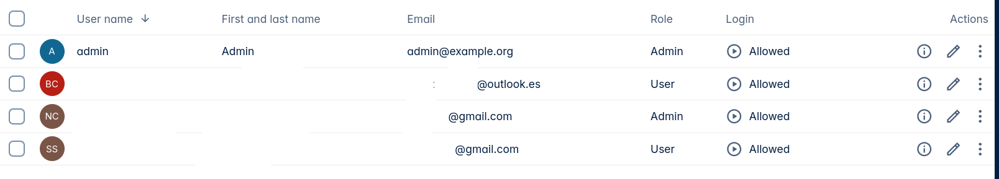

### Owncloud oCIS

oCIS está escrito en Go, lo que lo hace extremadamente rápido y ligero, funcionando como un binario único. Nextcloud utiliza PHP, lo que facilita su personalización pero requiere más recursos y optimización del servidor para grandes volúmenes.  

Mientras que oCIS se centra en ser un especialista en almacenamiento y sincronización a gran escala, Nextcloud se posiciona como una "Content Collaboration Platform" completa, incluyendo chat, videollamadas y oficina en línea de forma nativa.  

Llevo varios años usando Nextcloud y nunca he usado ninguna de sus aplicaciones. Tengo la sensación que es lento y por eso vamos a probar Owncloud.  

### Docker-compose
Si dejamos que docker cree las carpetas nos dará errores de permisos, por tanto las creamos de forma manual:
```bash
# Ficheros de configuración en appdata como siempre
mkdir -p /mnt/user/appdata/owncloud
# Almacenamiento de datos
mkdir -p /mnt/user/Owncloud-Files/ocis-data                          
mkdir -p /mnt/user/Owncloud-Files/thumbnails
```

Docker-compose:
```bash
services:
  ocis:
    image: owncloud/ocis:7
    container_name: owncloud
    user: 99:100          # nobody:users de Unraid
    
    ports:
      - 9200:9200
      
    entrypoint:
      - /bin/sh
    command: ["-c", "ocis init || true; ocis server"]
    
    environment:
      # URL publica
      OCIS_URL: https://cloud.midominio.com
      
      # Modo seguro
      OCIS_INSECURE: "false"        # true solo si usas cert autofirmado local
      HTTP_INSECURE: "true"
      PROXY_TLS: "false"            # el reverse proxy termina TLS
      PROXY_ENABLE_BASIC_AUTH: "false"   # solo activar para clientes WebDAV sin OIDC

      # Logs
      OCIS_LOG_LEVEL: error # en el primer arranque lo hacemos así para no tener muchas líneas de log. Después podemos poner info o debug si tenemos algún problema con servicios.
      
      # Authentication y OICD 
	  # Esta parte la configuramos luego. Nuestro primer arranque tiene que ser por password
      #PROXY_AUTOPROVISION_ACCOUNTS: true
      #PROXY_ROLE_ASSIGNMENT_DRIVER: oidc
      #OCIS_OIDC_ISSUER: https://pocket-id.midominio.com
      #PROXY_OIDC_REWRITE_WELLKNOWN: true
      #WEB_OIDC_CLIENT_ID: xxxxxxxxxxxxx-xxxxx-xxxx-xxxx-xxxxxxxxxxxxxx
      #PROXY_USER_OIDC_CLAIM: preferred_username
      #OCIS_EXCLUDE_RUN_SERVICES: idp
      
      # Configuración de seguridad y CSP
      #PROXY_CSP_CONFIG_FILE_LOCATION: /etc/ocis/csp.yaml
      
      # Servicios de oCIS
      SETTINGS_GRPC_ADDR: 0.0.0.0:9191
      GATEWAY_GRPC_ADDR: 0.0.0.0:9142
      OCIS_ADD_RUN_SERVICES: "notifications"

      # Almacenamiento datos y Thumbnails
      THUMBNAILS_FILESYSTEMSTORAGE_ROOT: /var/lib/ocis-thumbnails
      STORAGE_USERS_DATA_GATEWAY_URL: http://ocis:9200/data
      
      # Notificaciones por email
      OCIS_LDAP_USER_EMAIL_VERIFIED: "true"

      # Email SMTP    
      NOTIFICATIONS_SMTP_HOST: "${SMTP_HOST}"
      NOTIFICATIONS_SMTP_PORT: "${SMTP_PORT}"
      NOTIFICATIONS_SMTP_SENDER: "${SMTP_SENDER}"
      NOTIFICATIONS_SMTP_USERNAME: "${SMTP_USERNAME}"
      NOTIFICATIONS_SMTP_PASSWORD: "${SMTP_PASSWORD}"
      NOTIFICATIONS_SMTP_AUTHENTICATION: "${SMTP_AUTHENTICATION}"
      NOTIFICATIONS_SMTP_ENCRYPTION: "${SMTP_ENCRYPTION}"
      NOTIFICATIONS_SMTP_INSECURE: "${SMTP_INSECURE}"
      
      
      # Invitaciones de usuarios externos
      OCIS_GUEST_ENABLED: true
      NOTIFICATIONS_SEND_GUEST_INVITATIONS: true

    volumes:
      - /mnt/user/appdata/owncloud:/etc/ocis
      - /mnt/user/Owncloud-Files/ocis-data:/var/lib/ocis
      - /mnt/user/Owncloud-Files/thumbnails:/var/lib/ocis-thumbnails
    logging:
      driver: "local"
    restart: always
    
networks:
  default:
    name: cloud
    external: true
```

Fichero .env:
```bash
# Datos SMTP de Gmail
SMTP_HOST=smtp.gmail.com
SMTP_PORT=587
#SMTP_SENDER=oCIS notifications <mi_correo@gmail.com>
SMTP_SENDER=mi_correo@gmail.com
SMTP_USERNAME=mi_correo@gmail.com
SMTP_PASSWORD=xxxx xxxx xxxx xxxx
SMTP_AUTHENTICATION=login
SMTP_ENCRYPTION=starttls
SMTP_INSECURE=false
```

### Traefik
Por último, creamos nuestro fichero estático de traefik para nuestro dominio:
```bash
# cat cloud.yml                     
http:
  routers:
    cloud:
      rule: "Host(`cloud.midominio.com`)"
      service: cloud
      entryPoints:
        - websecure
      tls: {}   # o simplemente ‘tls: true’ en v3
      middlewares:
        - geoblock-es
        - crowdsec-bouncer-noappsec
        - security-headers
# En primer momento usé este header pero creo que no es necesario, por eso lo he comentado
#        - cloud-headers
#  middlewares:
#    cloud-headers:
#      headers:
#        customRequestHeaders:
#          X-Forwarded-Proto: "https"

  services:
    cloud:
      loadBalancer:
        servers:
          - url: "http://100.105.100.10:9200"
```

### Primer arranque
Arrancamos nuestro compose desde Unraid y verificamos los logs para ver nuestra pass de administrador:
```bash
docker logs owncloud
```

```bash
# Salida esperada:
=========================================
 generated OCIS Config
=========================================
 configpath : /etc/ocis/ocis.yaml
 user       : admin
 password   : xxxxxxxxxxxxxxxxxxxxxxxxxxxxxxx
```

### Usuarios
Vamos a crear nuestros usuarios. En mi caso crearemos varios usuarios desde el panel de administración de oCIS y luego activaremos el acceso a través de pocket-id con passkey.  
Mis usuarios:


### Configuración de pocket-id
En [la web de pocket-id](https://pocket-id.org/docs/client-examples/oCIS) tenemos varios ejemplos de aplicaciones.  

Los pasos son sencillos:  
1.- Creamos los grupos de oCIS necesarios, en mi caso el grupo de administrador y el de usuarios normales.  

En cada grupo le tenemos que añadir las reclamaciones personalizadas que se indican:
```bash
Add roles and ocisAdmin to Custom Claims and click Save in ocisAdmin group. Add admin users to this group under Users.
Add roles and ocisUser to Custom Claims and click Save in ocisUser group. Add standard users to this group under Users.
```

2.- Añadimos los usuarios correspondientes a cada grupo. Yo soy del grupo administrador y el resto de la familia del grupo usuarios.  

Creamos el cliente OIDC con los siguientes datos:
```bash
Nombre: Owncloud
URL callback: https://cloud.midominio.com/oidc-callback.html
# Según el manual hay que poner estas de callback, pero yo lo había hecho anteriormente y con la de arriba fue suficiente.
    https://ocis.company.com/
    https://ocis.company.com/oidc-callback.html
    https://ocis.company.com/oidc-silent-redirect.html

Cliente público: MARCADO [X]

Añadimos los grupos de usuarios permitidos en el nuevo cliente OIDC
```

Variables de entorno a añadir en el docker-compose:   
**Solo tenemos que descomentar las que ya teníamos**:
```bash
# Authentication y OICD 
PROXY_AUTOPROVISION_ACCOUNTS: true
PROXY_ROLE_ASSIGNMENT_DRIVER: oidc
OCIS_OIDC_ISSUER: https://pocket-id.midominio.com
PROXY_OIDC_REWRITE_WELLKNOWN: true
WEB_OIDC_CLIENT_ID: xxxxxxxxxxxx-xxxx-xxxx-xxxxx-xxxxxxxxxxxxxxxxxxx
PROXY_USER_OIDC_CLAIM: preferred_username
OCIS_EXCLUDE_RUN_SERVICES: idp
     
# Configuración de seguridad y CSP
PROXY_CSP_CONFIG_FILE_LOCATION: /etc/ocis/csp.yaml
```

Creamos nuestro fichero /mnt/user/appdata/owncloud/csp.yaml con el siguiente contenido:
```bash
directives:
  child-src:
    - '''self'''
  connect-src:
    - '''self'''
    - 'blob:'
    - 'https://raw.githubusercontent.com/owncloud/awesome-ocis/'
    # In contrary to bash and docker the default is given after the | character
    - 'https://pocket-id.midominio.com/'
  default-src:
    - '''none'''
  font-src:
    - '''self'''
  frame-ancestors:
    - '''none'''
  frame-src:
    - '''self'''
    - 'blob:'
    - 'https://embed.diagrams.net/'
  img-src:
    - '''self'''
    - 'data:'
    - 'blob:'
    - 'https://raw.githubusercontent.com/owncloud/awesome-ocis/'
  manifest-src:
    - '''self'''
  media-src:
    - '''self'''
  object-src:
    - '''self'''
    - 'blob:'
  script-src:
    - '''self'''
    - '''unsafe-inline'''
  style-src:
    - '''self'''
    - '''unsafe-inline'''
```

Reiniciamos nuestro contenedor y verificamos el login desde pocket-id.  

### Comandos útliles para verificar funcionamiento

Para que estos comandos funcionen, es importante que en el docker-compose modifiquemos el loglevel:
```bash
# Logs
OCIS_LOG_LEVEL: error / debug / info

DEBUG:	Detalle granular. Muestra cada paso interno, variables y eventos técnicos.	Se usa en Desarrollo y diagnóstico de errores complejos.	Impacto en rendimiento Alto: Genera archivos muy grandes rápidamente.

INFO	Confirmación de que las cosas funcionan. Reporta eventos normales (inicio de servicios, conexiones).	Se usa en Producción (por defecto en la mayoría de sistemas).	Impacto en rendimiento Moderado: Es el equilibrio estándar.

ERROR	Notificación de fallos críticos. Solo registra eventos que impiden una operación.	Sistemas estables donde solo te interesa saber si algo se rompió.	Impacto en rendimiento Bajo: Solo escribe cuando algo sale mal.
```

Revisar notificaciones:
```bash
docker inspect owncloud | grep NOTIFICATIONS_SMTP
```

Revisar logs docker:
```bash
docker logs ocis --tail=50
```

Verificar si oCIS está escuchando en el puerto:
```bash
docker exec ocis netstat -tlnp 2>/dev/null || docker exec ocis ss -tlnp
```

Prueba de conexión directa:
```bash
curl -k https://100.105.100.10:9200
```

Listado de servicios oCIS en ejecución:
```bash
docker exec owncloud ocis list
```

Verificaciones de notificaciones:
```bash
docker logs -f owncloud 2>&1 | grep -i -E "notification|smtp|email|mail|send"
```

Variables de entorno que carga oCIS:
```bash
docker exec owncloud env
```

### Vitaminar nuestro Owncloud

Instalación de tika.  
Por defecto oCIS solo indexa nombres de archivo y contenido de texto plano. Con Apache Tika puedes activar búsqueda en PDFs usando OCR.   

Añadimos esto a nuestro compose:
```bash
# Añadir estas variables a ocis > environment:
  # SEARCH_EXTRACTOR_TYPE: tika
  # SEARCH_EXTRACTOR_TIKA_TIKA_URL: http://tika:9998
  # FRONTEND_FULL_TEXT_SEARCH_ENABLED: "true"

  tika:
    image: apache/tika:latest-full
    container_name: tika
    restart: always
    logging:
      driver: local
```

Antivirus con ClamAV.  

Añadimos al compose:
```bash
# Añadir a ocis > environment:
  # ANTIVIRUS_SCANNER_TYPE: clamav
  # ANTIVIRUS_INFECTED_FILE_HANDLING: delete
  # ANTIVIRUS_CLAMAV_SOCKET: "/var/run/clamav/clamd.sock"
  # OCIS_ADD_RUN_SERVICES: "antivirus"
  # POSTPROCESSING_STEPS: "virusscan"
  # Y añadir volumen: clamav-socket:/var/run/clamav

  clamav:
    image: clamav/clamav:latest
    container_name: clamav
    volumes:
      - /mnt/user/appdata/ocis/clamav:/var/lib/clamav
      - clamav-socket:/tmp

volumes:
  clamav-socket:
```


***  
Fuentes:  
[Documentación Owncloud](https://doc.owncloud.com/ocis/next/depl-examples/ubuntu-compose/ubuntu-compose-prod.html#download-and-transfer-the-example)  
[Owncloud oCIS en docker](https://owncloud.dev/ocis/guides/ocis-local-docker/)  


